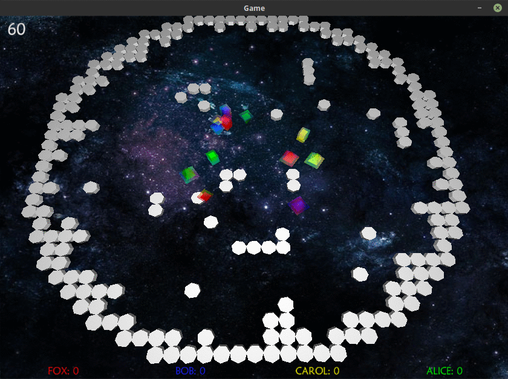

# Tiarait is a Recursive AI Title

TIARAIT is a server-client based game where four players try to color as much arena area as possible. They do so by programming their three bots (eraser, cube and pyramid) using, for example, pathfinding or clustering algorithms. The bots differentiate in speed and coloring capabilities. Code in this repo is a live demonstration for one possible client. It uses pathfinding with Dijkstra, while eraser pursuits the enemy with the maximal score, the cube sequentially processes the field and the pyramid relies on a random generator for target finding.



## getting started

- server and three dummy clients can be started using ./starter3
- the player's client must be started manually
```
mvn clean package
java -jar target/TiaraitClient.jar <SERVER_IP> <TEAM_NAME>
eg: java -jar target/TiaraitClient.jar 127.0.0.1 winner
```
